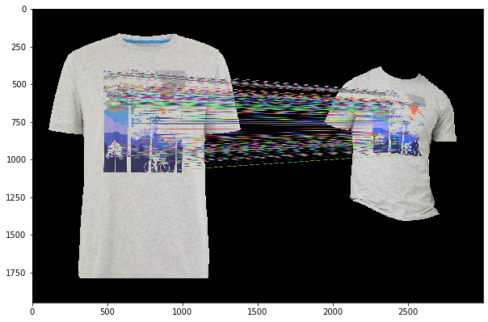
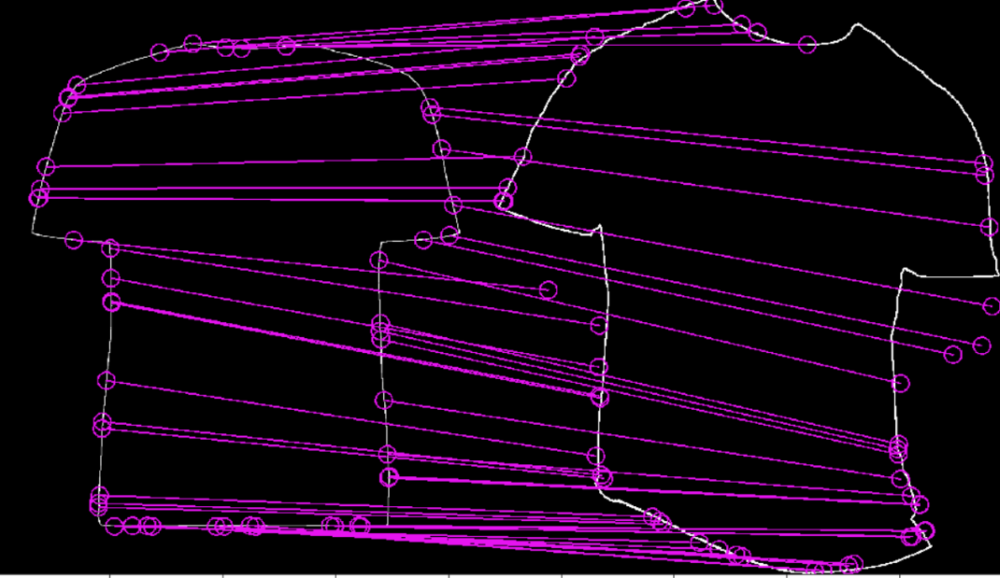

# Computer-Vision-Points-registration-and-matching

The task is to figure out mapping from one clothing item to another clothing item and generate a mapping that matches points from one image to another image in a slightly different (warped) position. 

Like this:

Or this:

Experiments were done with ORB detector, SIFT, SURF and ECC. The  gives more details about the experiments and lessons learnt.
